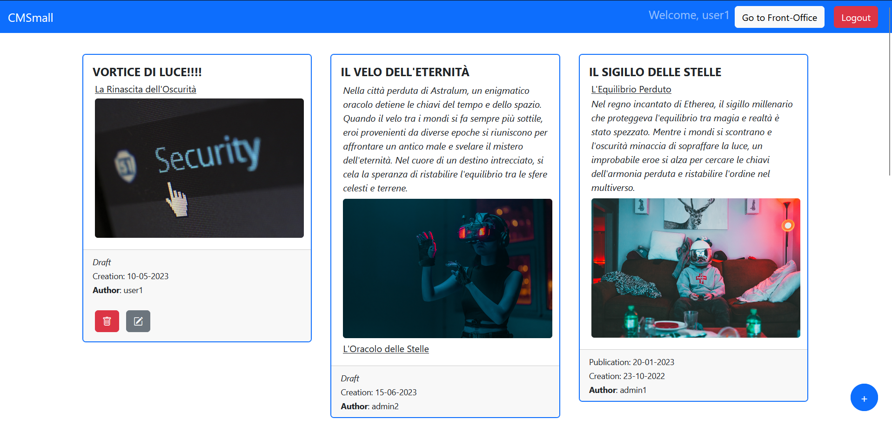
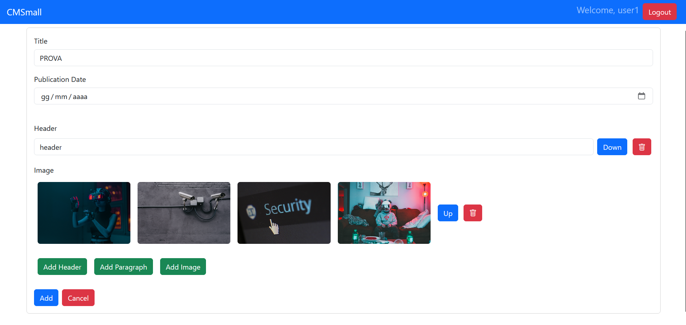

[](https://classroom.github.com/a/suhcjUE-)
# Exam #1: "CMSmall"
## Student: s317541 SANINO FABRIZIO 

## React Client Application Routes

- Route `/`: it shows the publicated pages with the related blocks.
- Route `/back-office`: only authenticated users can use this route. It shows all the pages with the related blocks.
- Route `/add`: only authenticated users can use this route. It shows a form in which the user can insert a new page and blocks.
- Route `/edit/:pageId`: only authenticated users can use this route. It's used for modify an existing page and blocks. _:pageId_ is the page that user want to modify.
- Route `/editWebsiteName`: only authenticated administrator users can use this route. It shows a form in which the user can modify the website name.
- Route `/login`: It shows a form that is used for authenticating the user.
- Route `/*`: It show a back button because the route doesn't exist.

## API Server
Hereafter, we report the designed HTTP APIs, also implemented in the project.

- GET `/api/pages/published`
  - Get all the published (publication is before or equal to today date) pages with their blocks.
  - Request body: _None_
  - Response code: `200 OK` (success), `500 Internal Server Error` (generic error), `503 Service Unavailable` (database error)
  - Response body:  
  ```
    [
      {
        "id": 1,
        "title": "EXAM",
        "creation": "2023-06-12",
        "publication": "2023-06-13",
        "authorId": 1,
        "authorName": "Jhon"
        "blocks": [
          {
            "id": 1,
            "type": "header",
            "header": "AW1",
            "paragraph": "",
            "image": "",
            "imageUrl": "",
            "position": 0
          },
          ...
        ]
      },
      ...
    ]
    ```

- GET `/api/pages` 
  - Get all the pages with their blocks. A cookie with a VALID SESSION ID must be provided. 
  - Request body: _None_
  - Response code: `200 OK` (success), `500 Internal Server Error` (generic error) or `401 Unauthorized` (error)
  - Response body:  
  ```
    [
      {
        "id": 1,
        "title": "EXAM",
        "creation": "2023-06-12",
        "publication": NULL,
        "authorId": 1,
        "authorName": "Jhon"
        "blocks": [
          {
            "id": 1,
            "type": "header",
            "header": "AW1",
            "paragraph": "",
            "image": "",
            "imageUrl": "",
            "position": 0
          },
          ...
        ]
      },
      ...
    ]
    ```

- GET `/api/wbsite/name` 
  - Get the WebSite's name. 
  - Request body: _None_
  - Response code: `200 OK` (success) or `500 Internal Server Error` (generic error).
  - Response body:  
  ```
    {
      "name": "CMSmall"
    }
  ```

- PUT `/api/website/name` 
  - Update the WebSite's name. A cookie with a VALID SESSION ID must be provided.
  - Request body: 
  ```
    {
      "webSiteName": "CMSMALL"
    }
  ```
  - Response code: `200 OK` (success), `500 Internal Server Error` (generic error) or `401 Unauthorized` (Requested by non-administrator user). If the request body is not valid, `422 Unprocessable Entity` (validation error)
  - Response body:  
  ```
    {}
  ```

- DELETE `/api/pages/:id` 
  - Delete the page, identified by its id, and the related blocks. A cookie with a VALID SESSION ID must be provided. Depending on the SESSION (administrator or not), the administrator can delete pages of which he's not the author. Others users can only delete their pages.
  - Request body: _None_
  - Response code: `200 OK` (success), `503 Service Unavailable` (generic error) or `401 Unauthorized` (error)
  - Response body:  
  ```
    { #PagesDeleted + #BlocksDeleted }
  ```

- GET `/api/images` 
  - Get the urls of the images. 
  - Request body: _None_
  - Response code: `200 OK` (success) or `500 Internal Server Error` (generic error).
  - Response body:  
  ```
    [
      {
        "id": 0,
        "url": "http://localhost:3001/static/immagine1.jpg"
      }
    ]
  ```

- GET `/api/users` 
  - Get the users. A cookie with a VALID SESSION ID must be provided. Dependin on the SESSION only administrator can get the results.
  - Request body: _None_
  - Response code: `200 OK` (success), `500 Internal Server Error` (generic error) or `401 Unauthorized` (Requested by non-administrator user)
  - Response body:  
  ```
    [
      {
        "id": 0,
        "username": "Jhon@cms.it",
        "name": "Jhon",
        "role": "",
      }
    ]
  ```

- POST `/api/pages` 
  - Add a new page with their blocks and it generate the creation date of the page (current date). Id in the reqeust body are ignored. A cookie with a VALID SESSION ID must be provided. Depending on the SESSION, the author is taken from the body (administrator SESSION) and must be a valid user, or from the SESSION (not administrator SESSIONS). If an administrator does not provide an author, he will become himself.
  - Request body:
  ```
    {
      "title": "EXAM",
      "publication": "",
      "blocks": [
        {
          "type": "header",
          "header": "AW1",
          "paragraph": "",
          "image": "",
          "position": 0
        },
        ...
      ]
    }
  ```
  - Response code: `201 Created` (success), `503 Service Unavailable` (generic error), `401 Unauthorized` (error) or `422 Unprocessable Entity` (validation error)
  - Response body:  
  ```
    { id of the added page }
  ```

- PUT `/api/pages/:id` 
  - Update a page, identified by its id, with their blocks. Id in the reqeust body are ignored. A cookie with a VALID SESSION ID must be provided.Depending on the SESSION, the author is taken from the body (administrator SESSION) and must be a valid user. Not administrator SESSIONS can't change the author so if it's presente it will be discarded. 
  - Request body:
  ```
    {
      "title": "EXAM",
      "publication": "",
      "blocks": [
        {
          "type": "header",
          "header": "AW1",
          "paragraph": "",
          "image": "",
          "position": 0
        },
        ...
      ]
    }
  ```
  - Response code: `201 Created` (success), `503 Service Unavailable` (generic error), `401 Unauthorized` (error) or `422 Unprocessable Entity` (validation error. i.e the administrator use an unexisting author)
  - Response body:  
  ```
    { id of the updated page }
  ```

- POST `/api/sessions`
  - Create a new session starting from given credentials.
  - Request body: 
    ```
    {
      "username": "user1@cms.it",
      "password": "password"
    }
    ```
  - Response body:
    ```
    {
      "id": 1,
      "username": "user1@cms.it",
      "name": "user1",
      "role": null
    }
    ```
  - Response code: `200 OK` (success) or `500 Internal Server Error` (generic error).


- GET `/api/sessions/current`
  - Get the current session if existing.
  - Description: Verify if the given session is still valid and return the info about the logged-in user. A cookie with a VALID SESSION ID must be provided to get the info of the user authenticated in the current session. 
  - Request body: _None_
  - Response body:
    ```
    {
      "id": 1,
      "username": "user1@cms.it",
      "name": "user1",
      "role": null
    }
    ```
  - Response code: `201 Created` (success) or `401 Unauthorized` (error).


- DELETE `/api/sessions/current`
  - Destroy the current session (logout).
  - Description: Delete the current session. A cookie with a VALID SESSION ID must be provided.
  - Request body: _None_
  - Response body: empty object (_{}_)
  - Response code: `200 OK` (success) or `500 Internal Server Error` (generic error).

## Database Tables

- Table `users` - contains: _id_: (PRIMARY_KEY, AUTOINCREMENT), _email_, _name_ (OPTIONAL), _password_ (hashed), _salt_, _role_ (REQUIRED only for administrators)
- Table `website` - contains: _name_: (TEXT, NOT NULL)
- Table `images` - contains: _id_: (PRIMARY KEY, AUTOINCREMENT), _url_: (TEXT)
- Table `pages` - contains: _id_: (PRIMARY KEY, AUTOINCREMENT), _title_, _creation_, _publication_, _author_: (INTEGER)
- Table `blocks` - contains: _id_: (PRIMARY KEY, AUTOINCREMENT), _type_, _header_, _paragraph_, _image_: (INTEGER), _page_: (INTEGER), _position_

## Main React Components

- `MainLayout` (in `MainLayout.js`): component that is used for display the pages (PageCard component). It is used both for front-office and for back-office. The difference is pages that the component shows (pages are contained in a state) 
- `PageCard` (in `PageCard.js`): is used for display a single page.
- `PageForm` (in `PageForm.js`): is used for modify or update a page and/or their blocks.
- `Login` (in `AuthComponents.js`): is used for display the login page.

## Screenshot

(All Pages - Back-Office)

(Page Form)



## Users Credentials

- MAIL, PASSWORD, ROLE
- u1@c.it, pwd, NULL
- u2@c.it, pwd, NULL
- u3@c.it, pwd, NULL
- a1@c.it, pwd, administrator
- a2@c.it, pwd, administrator

